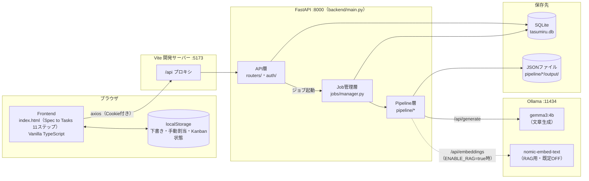
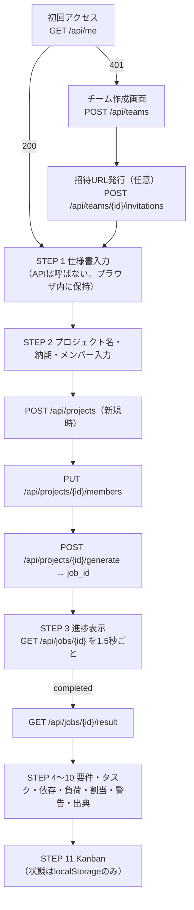
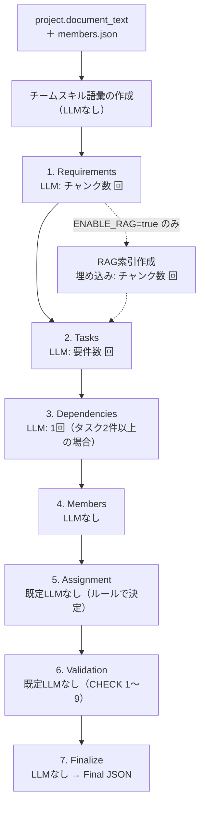
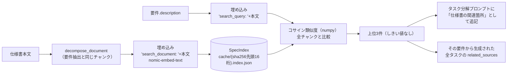
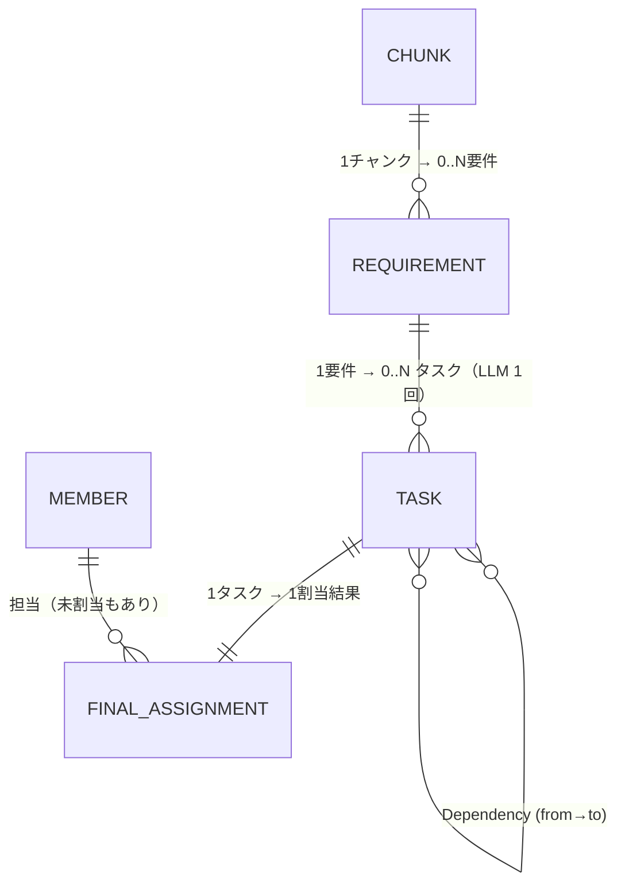
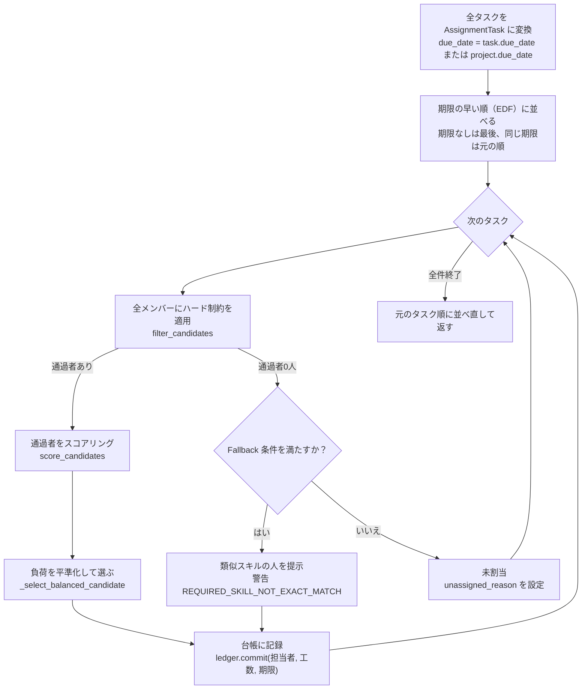
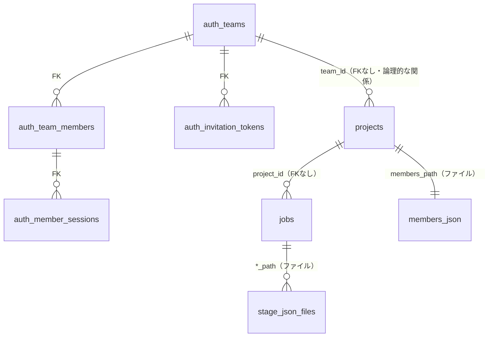

# タスみる システム全体ドキュメント

> **対象読者**: タスみるの開発チーム全員（途中参加メンバー・非エンジニアを含む）
> **基準**: 2026-09-29 時点の `main` ブランチ（最新コミット `14f6c2f`）の**実装コード・型定義・テスト**。README や既存ドキュメントと食い違う箇所は、コードを正とし、差異を明記しています。
> **表記ルール**
> - `path/to/file.py:123` … 根拠となるコードの場所（リポジトリルートからの相対パス）
> - **未実装** … コード上に存在しない機能
> - **未確認** … コードやリポジトリ内の記録からは裏付けられなかった事項
> - 「実験的」 … 実装はあるが既定で無効、または正式機能として扱っていないもの

---

## 目次

1. このシステムについて
2. システム全体像
3. ユーザー操作の流れ
4. Pipeline（処理の流れ）
5. LLM
6. RAG
7. Task生成
8. Assignment（担当者割り当て）
9. Validation（検証）
10. JSON出力
11. API
12. Frontend
13. 認証・データ管理
14. 開発環境
15. 性能
16. テスト
17. 現在の制約
18. 今後の改善候補
19. 開発者向けファイルマップ
20. 新メンバー向け「まず読む場所」

---

## 1. このシステムについて

### 1.1 タスみるを一言でいうと

**「仕様書を渡すと、AIが『やること（タスク）』の一覧を作り、チームの誰が担当するかまで提案してくれるシステム」** です。

### 1.2 初心者向けの説明（専門用語なし）

1. あなたは、チームで作るシステムの「仕様書」（何を作るかを書いた文章）を画面に貼り付けます。
2. チームのメンバーと、それぞれの得意なこと（例：Python がレベル4）と、1週間に働ける時間を入力します。
3. 「AI分析を開始」を押すと、パソコンの中で動く AI（Ollama というソフトの上で動く Gemma 3 というモデル）が仕様書を少しずつ読みます。
4. AI はまず「この仕様書が求めていること（要件）」を書き出し、次に要件ごとに「具体的な作業（タスク）」に分けます。さらに「この作業はあの作業が終わってから」という順番（依存関係）も考えます。
5. ここから先は AI ではなく**決まった計算ルール**で、「その作業に必要な技術を持っていて、しかも手が空いている人」を選びます。1人に仕事が集中しないよう、忙しさ（負荷率）が 100% を超える割り当てはしません。
6. 最後に、抜けている要件や重複した作業、働きすぎの人がいないかを自動でチェックします（検証）。
7. 結果は画面で確認でき、タスクの状態はカンバンで管理できます。結果全体は JSON というデータ形式で取り出せます。

### 1.3 解決する課題

- 仕様書からタスクを洗い出す作業は時間がかかり、抜け漏れや重複が起きやすい。
- 誰に何を任せるかを決めるとき、スキルと忙しさの両方を考えるのは手間がかかる。
- AI の出力を鵜呑みにすると危険なので、**根拠（仕様書のどこから来たか）を残し、検証結果を表示して人が確認できる**ようにしている。

### 1.4 システムの設計方針（コードから読み取れるもの）

| 方針 | 実装での表れ |
|---|---|
| 仕様書を一度に全部 LLM に渡さない | 仕様書を小さな単位（チャンク）に分け、段階ごとに LLM を呼ぶ（§4, §5） |
| LLM に任せるのは「文章の理解」だけ | 担当者の決定・負荷計算・検証はすべてルールで決める（§8, §9） |
| ローカル LLM で動かす | 既定は Ollama + `gemma3:4b`（`.env.example`） |
| 出力は特定のツールに依存しない JSON | `FinalProjectOutput`（§10） |
| 問題は隠さず報告する | 各段階の `issues`、`needs_review`、Validation レポート |

---

## 2. システム全体像

### 2.1 全体構成図



### 2.2 構成要素

| 要素 | 技術 | 役割 |
|---|---|---|
| Frontend | Vanilla TypeScript + Vite 8 + axios + lucide（アイコン）。React などのフレームワークは**不使用** | 画面表示。`innerHTML` にテンプレート文字列を入れて描画する |
| Backend | Python 3.12 / FastAPI / SQLAlchemy（async）/ Pydantic v2 | API、ジョブ実行、パイプライン処理 |
| Ollama | ローカル LLM サーバー | LLM の実行（`POST /api/generate`）、埋め込み（`POST /api/embeddings`） |
| LLM | 既定 `gemma3:4b`（`.env.example`）。※コード上の既定値は `llama3.1:8b`（§5.2） | 要件抽出・タスク分解・依存関係提案 |
| DB | SQLite（`./tasumiru.db`、`backend/config.py:12`） | チーム・メンバー・セッション・プロジェクト・ジョブの状態 |
| File storage | `backend/pipeline/*/output/` などの JSON ファイル | 各段階の成果物（要件・タスク・依存・メンバー・割当・検証・最終結果） |

---

## 3. ユーザー操作の流れ

### 3.1 全体の流れ（実装どおり）



### 3.2 各操作の詳細

| 操作 | ユーザーがすること | 実際に起きること |
|---|---|---|
| チーム作成 | チーム名と自分の表示名を入力 | `POST /api/teams`。チームと管理者メンバーが作られ、セッション Cookie が発行される。続けて招待トークンも発行され、招待URL `/?token=...` が表示される |
| 招待参加 | 招待URLを開き、表示名を入力 | `POST /api/invitations/{token}/join`。一般メンバーとして参加し、Cookie が発行される |
| 仕様書アップロード（STEP 1） | テキスト系ファイルのドロップ／貼り付け／「サンプル仕様書で試す」 | **API は呼ばない**。本文はブラウザ内で保持し、localStorage `tasumiru.s2t.draft` に保存する。**PDF・Word は画面側で拒否**され、本文の貼り付けを求められる（`frontend/src/specToTasks/app.ts:1120-1149`） |
| プロジェクト作成（STEP 2） | プロジェクト名と納期（任意）を入力 | 新規の場合は `POST /api/projects {name, due_date}` |
| メンバー登録（STEP 2） | 氏名／スキル（`Python:4, React:3` 形式）／稼働h/週／既存h を入力 | `PUT /api/projects/{id}/members`。レベルを省略すると 3、稼働曜日は月〜金になる（`frontend/src/specToTasks/model.ts:493-504`, `app.ts:1168-1186`） |
| タスク生成 | 「AI分析を開始」 | `POST /api/projects/{id}/generate`。バックグラウンドでジョブが走り、`job_id` が返る |
| 割り振り | （自動） | ジョブの中で Assignment が実行される |
| 確認 | STEP 4〜11 を見る | 結果JSONを画面用のモデルに変換して表示する。担当の手動変更や Kanban の状態は localStorage にだけ保存される |

---

## 4. Pipeline（処理の流れ）

### 4.1 全体フロー

ジョブの本体は `backend/jobs/manager.py:181-238`（`JobManager.run_job`）です。段階は必ず次の順に実行されます。



### 4.2 各段階の入出力

| # | 段階 | 入力 | 処理 | 主なファイル | LLM | 出力（保存先） | 進捗% |
|---|---|---|---|---|---|---|---|
| 0 | スキル語彙 | members.json | 全メンバーのスキル名を正規化して重複を除き、最大100件の語彙を作る | `pipeline/tasks/skill_vocabulary.py` | なし | メモリ上のみ | — |
| 1 | Requirements | 仕様書本文 | チャンクに分割し、チャンクごとに要件を抽出。ID `REQ-001…` を機械的に採番 | `pipeline/requirements/{runner,extractor,validator}.py`, `services/pipeline/structure.py` | **あり** | `RequirementDocument`（`pipeline/requirements/output/*.requirements.json`） | 5→25 |
| 1' | RAG索引 | 仕様書本文 | チャンクを埋め込みベクトル化（キャッシュあり） | `services/rag/index.py` | 埋め込み | `services/rag/cache/*.index.json` | — |
| 2 | Tasks | 要件一覧（＋語彙、＋RAG） | 要件1件ごとにタスクへ分解。ID `TASK-001…`。検証と、スキル整合性チェックの結果を `needs_review` に反映 | `pipeline/tasks/{runner,decomposer,validator,skill_evaluation}.py` | **あり** | `TaskDocument`（`pipeline/tasks/output/*.tasks.json`） | 25→50 |
| 3 | Dependencies | タスク一覧 | 全タスクの依存関係を1回で提案し、グラフを検証 | `pipeline/dependencies/{runner,proposer,validator,graph}.py` | **あり** | `DependencyDocument`（`pipeline/dependencies/output/*.dependencies.json`） | 50→65 |
| 4 | Members | members.json | メンバー情報を読み込んで検証 | `pipeline/members/{runner,schema,validator}.py` | なし | `MemberDirectory`（メモリ上） | 65→70 |
| 5 | Assignment | タスク・依存・メンバー | 期限順に1件ずつ、制約・負荷・スキルで担当者を決める | `jobs/manager.py:364-430`, `pipeline/assignment/*` | 既定なし（任意で理由文だけ生成） | `FinalAssignment[]`（`backend/jobs/output/{job_id}.assignments.json`） | 70→90 |
| 6 | Validation | 上記すべて | CHECK 1〜9 を実行し、問題を報告のみ行う | `pipeline/validation/*` | 既定なし（任意で重複判定） | `ValidationReport`（`pipeline/validation/output/validation_*.json`） | 90→95 |
| 7 | Finalize | 上記すべて | 1つの JSON に組み立てる | `pipeline/final_output/*` | なし | `FinalProjectOutput`（`pipeline/final_output/output/*.final.json`） | 95→100 |

進捗率（`STAGE_BOUNDS`, `jobs/manager.py:79-87`）は**各段階の開始時と終了時にだけ**更新され、経過時間に応じて動くことはありません。

### 4.3 エラー時の挙動（段階共通）

- LLM 呼び出しの失敗（最大3回の試行後）は、その段階の `issues` に記録され、**ジョブは継続**します。
  - 例：要件抽出に失敗したチャンク → `EXTRACTION_ERROR`
  - 例：タスク分解に失敗した要件 → `DECOMPOSITION_ERROR`
  - 例：依存関係の提案失敗 → `PROPOSAL_ERROR`
- それ以外の例外（Ollama への接続不可、members.json が読めない、など）が起きると、ジョブは `failed` になります。エラーコードは `jobs/errors.py:16-30` で分類します。

| 例外の種類 | ジョブの error.code |
|---|---|
| `HTTPException`（detail に code があるもの） | その code（例：`LLM_TIMEOUT`） |
| `ConnectionError` / `OSError` | `OLLAMA_UNAVAILABLE` |
| `ValueError` | `VALIDATION_ERROR` |
| その他 | `INTERNAL_ERROR` |

### 4.4 進捗画面のログはいつ出るか

- バックエンドは各段階の**開始時**に「〜しています...」、**終了時**に「〜が完了しました。」を `job.message` に書き込みます（`jobs/manager.py:89-107`）。
- フロントは 1.5 秒ごとのポーリングで、その時点の `message` をログに追加します（`frontend/src/specToTasks/app.ts:1247-1268`）。
- ある段階の終了メッセージは、直後に次の段階の開始メッセージで上書きされるため、**実際に画面に出るのはほぼ開始メッセージだけ**です。ログの時刻も「フロントが受け取った時刻」であり、処理が実際に始まった・終わった時刻ではありません。

---

## 5. LLM

### 5.1 呼び出しの仕組み

- クライアントは `backend/services/llm.py` にあります。`LLM_PROVIDER` の値で実装を切り替えます。

| `LLM_PROVIDER` | 実装 | 備考 |
|---|---|---|
| `ollama` | `OllamaClient` | 標準構成 |
| `anthropic` | `AnthropicClient` | `max_tokens=2000`、`json_mode` は無視（コードフェンスを除去して対応） |
| `openai` | `OpenAIClient` | **モック**。常に `"{}"` を返す |
| 未設定・その他 | `RuntimeError` | ジョブは失敗する |

- Ollama へのリクエスト（`llm.py:69-81`）

```json
POST {OLLAMA_BASE_URL}/api/generate
{ "model": "<OLLAMA_MODEL>", "prompt": "...", "stream": false,
  "options": { "num_ctx": 8192 }, "format": "json" }
```

- **JSON mode**：Ollama の `format: "json"` を使用しています。**JSON スキーマ（structured output）は渡していません**。期待する形はプロンプトの文章だけで指示しています。
- **temperature / num_predict / seed / top_p**：本番コードでは**一切指定していません**（Ollama とモデルの既定値のまま）。
- **タイムアウト**：300 秒（`llm.py:79`）。超えると `HTTPException 504 LLM_TIMEOUT` になります。

### 5.2 LLM 関連の環境変数

| 変数 | コード上の既定値 | `.env.example` | 説明 |
|---|---|---|---|
| `LLM_PROVIDER` | なし（必須） | `ollama` | |
| `OLLAMA_BASE_URL` | なし（必須） | `http://localhost:11434` | 埋め込みでも使用 |
| `OLLAMA_MODEL` | **`llama3.1:8b`**（`llm.py:11`） | **`gemma3:4b`** | ⚠ `.env` が無いと llama3.1:8b になる。`start-dev.ps1` は既定で gemma3:4b を設定する |
| `OLLAMA_NUM_CTX` | 8192（`llm.py:36`） | コメントアウト | 以前は Ollama 側の実質既定値（約4096）でプロンプトが切り詰められ、JSON 異常と再試行の原因になっていたため引き上げた（`llm.py:30-35` のコメント） |
| `OLLAMA_MAX_CONCURRENCY` | 1（`services/concurrency.py:23-35`） | コメントアウト | LLM の同時呼び出し数。既定は完全に逐次 |
| `OLLAMA_EMBEDDING_MODEL` | `nomic-embed-text` | 同左 | RAG 用 |
| `ENABLE_RAG` | `false` | `false` | §6 |
| `ANTHROPIC_API_KEY` / `ANTHROPIC_MODEL` | なし / `claude-sonnet-5` | コメントアウト | |

> 補足：`.env` はルートで `load_dotenv()` により読み込まれます（`backend/main.py:5`）。`llm.py` の値はモジュールの import 時に1回だけ読まれるため、変更したらサーバーの再起動が必要です。

### 5.3 リトライ（`services/pipeline/llm_json.py`）

- `MAX_RETRIES = 2` なので、**最大3回**試行します。
- 再試行の条件：
  - JSON として解析できない
  - `complete()` が `HTTPException` を投げた（タイムアウトを含む）
  - 結果が dict でも、dict の配列でもない
- 解析前に、コードフェンスの除去と、最初の `{...}` / `[...]` の抽出を行います。トップレベルが配列なら先頭の dict を使います。
- 3回とも失敗した場合は例外を投げず `(None, error)` を返し、呼び出し元の段階が issue として記録します。
- 項目が欠けているなど「中身の不備」では再試行しません。各段階が該当項目を捨てるか、既定値で補います。

### 5.4 「仕様書全体を1回で LLM に投げているわけではない」

| 段階 | 呼び出し回数 | LLM に渡すもの | LLM が返すもの |
|---|---|---|---|
| Requirements | **チャンク数 C 回** | 1チャンク分の見出しと本文 | 要件の配列（type / title / description / priority / origin / confidence） |
| Tasks | **要件数 R 回** | 要件1件の type・title・description ＋（任意）チームスキル語彙 ＋（RAG ON 時）関連チャンク3件。**仕様書本文そのものは渡さない** | タスクの配列（title / description / priority / estimated_hours / required_skills / acceptance_criteria / confidence） |
| Dependencies | **1 回**（タスクが2件未満なら0回） | 全タスクの `ID: タイトル — 説明` | 依存の配列（from / to / type / reason / confidence） |
| Members | 0 回 | — | — |
| Assignment | 0 回（`use_assignment_llm_reasoning=true` のときタスク数 T 回） | 上位3候補のスコア内訳 | 補足の理由文・警告文のみ（**担当者は決めない**） |
| Validation | 0 回（`use_duplicate_llm_verification=true` のとき重複候補ペア数 D 回） | 2タスクのタイトルと説明 | 重複か否かの判定コメント（**件数は変えない**） |

- **呼び出し回数の目安** ＝ C ＋ R ＋ (T≥2 なら 1) ＋ [任意 T] ＋ [任意 D]。最悪の場合はこの3倍（リトライ）になります。
- 既定の同時実行数は 1 なので、**すべて順番に実行**されます。

#### チャンク分割の方法（`services/pipeline/structure.py:28-101`、ルールベース）

次の優先順で、最初に当てはまった方法で分割します。

1. `第N条` の見出しがあれば、条ごとに分割します（見出しは `section` として残る）。
2. 空行で区切られた段落が2つ以上あれば、段落ごとに分割します。
3. 本文が300文字を超えていれば、`。` で文に分け、200文字以内にまとめます。
4. どれにも当てはまらなければ、全体を1チャンクにします。

- チャンク同士の重なり（overlap）はありません。
- 条・段落単位のチャンクには**長さの上限がありません**。
- ページ番号は取得しません（`page` は常に `null`）。Markdown の `#` 見出しも認識しません。

---

## 6. RAG

### 6.1 状態

- **実装済み・実験的機能・既定は OFF** です（`ENABLE_RAG` の既定値は `false`。コードは `jobs/manager.py:127-133`、`.env.example` も同じ）。
- `1` / `true` / `yes` のいずれかを指定したときだけ有効になります。

### 6.2 仕組み（ON のとき）



- 索引は要件抽出の後に1回だけ作ります（`manager.py:288-306`）。同じ本文ならキャッシュを使い、埋め込み API は呼びません。
- `RagSource` のフィールド（`services/rag/schema.py:23-36`）：`chunk_id`、`document_id`、`page`（常に null）、`section`（チャンクの見出し）、`similarity`（0〜1）
  - **原文テキストは保存しません**。原文の根拠は別フィールド `source_reference.source_text` に入ります。

### 6.3 ON と OFF の違い

| 項目 | OFF（既定） | ON |
|---|---|---|
| 要件抽出 | 同じ | 同じ |
| 埋め込み API の呼び出し | 0 回 | チャンク数（キャッシュヒット時は0）＋ 要件数 |
| タスク分解のプロンプト | 要件のみ | 要件 ＋ 関連チャンク3件の全文 |
| `Task.related_sources` | `[]` | 上位3件 |
| 索引作成の失敗 | — | ログに記録し、RAG なしで継続 |
| 検索（クエリ埋め込み）の失敗 | — | ⚠ 例外処理が無いため**ジョブ全体が失敗する**（`pipeline/tasks/decomposer.py:157-160`） |
| Frontend での表示 | — | **表示されない**（`related_sources` はフロントの型にも存在しない） |

---

## 7. Task生成

### 7.1 Task の構造（`backend/pipeline/tasks/schema.py:52-76`）

| フィールド | 型 | 誰が決めるか | 説明 |
|---|---|---|---|
| `id` | `TASK-001` 形式 | コード（連番） | |
| `requirement_ids` | `List[str]` | コード | 元になった要件（**常に1件**） |
| `title` / `description` | str | LLM | 空の場合はタスクごと破棄 |
| `priority` | high / medium / low / unknown | LLM | 不正な値は unknown に |
| `estimated_hours` | float または null | LLM | 数値でなければ null |
| `required_skills` | `List[str]` | LLM | 空または不正なら `["unknown"]`。**正規化で書き換えはしない** |
| `acceptance_criteria` | `List[str]` | LLM | 完了条件 |
| `source_reference` | `SourceReference` | コード（要件からコピー） | `document_id` / `page`（null）/ `section` / `paragraph`（chunk_id）/ `source_text`（チャンク原文） |
| `confidence` | 0〜1 | LLM | 不正な値は 0.5 に |
| `related_sources` | `List[RagSource]` | RAG | OFF のときは `[]` |
| `needs_review` / `review_reasons` | bool / `List[str]` | コード（検証結果） | 下記 7.3 |
| `due_date` | date または null | **LLM は設定しない**（常に null） | 割り当て時にはプロジェクト納期で補完（§8.6） |

### 7.2 Requirement との関係



- 要件の `type` は9種類あります：`system_purpose` / `target_user` / `functional` / `non_functional` / `constraint` / `assumption` / `deliverable` / `technical` / `business_rule`
- `origin` は `explicit`（本文に明記）か `inferred`（推定）です。推定のときは信頼度 0.4 以下を推奨とプロンプトで指示しています。
- 要件の重複を統合することはしません。検出して issue として報告するだけです。

### 7.3 「良いタスク」の判定（生成時点のチェック）

タスク分解のプロンプトは、良いタスクの条件として「目的が1つ」「実行可能」「完了を判定できる」「大きすぎない」「細かすぎない」「担当者を決められる」を示しています（`decomposer.py:31-73`）。生成後には、次のルールベースのチェックが**必ず**実行されます。

| コード | 条件 | 由来 |
|---|---|---|
| `TASK_WITHOUT_REQUIREMENT` | requirement_ids が空 | `tasks/validator.py` |
| `DUPLICATE_TASK` | タイトル類似度 ≥ 0.85 | 同上 |
| `OVERLY_BROAD_TASK` | 「システム全体」「全機能」「一式」などを含む／タイトルに接続語がある／タイトルが80文字超 | 同上 |
| `OVERLY_GRANULAR_TASK` | 些細な UI 語（ボタンの色など）を含み、しかも要件側に根拠が無い | 同上 |
| `MISSING_SOURCE_REFERENCE` | 出典テキストが無い | 同上 |
| `MISSING_ACCEPTANCE_CRITERIA` | 完了条件が空 | 同上 |
| `INVALID_ESTIMATED_HOURS` | 見積りが 0 以下、または 500 超 | 同上 |
| `SKILL_TASK_MISMATCH` | 作業内容（キーワードで分類）と必要スキルの分野が合わない | `tasks/skill_evaluation.py` |
| `SECURITY_SKILL_MISSING` | セキュリティが目的のタスクなのに、セキュリティ系スキルが無い | 同上 |

これらの issue が付いたタスクは `needs_review=true` になり、`review_reasons` に `"CODE: メッセージ"` の形で理由が入ります（`validator.py:228-245`）。**タスク自体を修正・削除することはありません。**

### 7.4 品質評価の9観点（オフライン評価ツール）

依頼にあった9観点は `backend/evaluation/` に実装されています。ただし次の2点に注意してください。

- **通常のジョブでは実行されない**オフライン専用のツールです。
- 評価対象は**旧パイプライン**（`services/pipeline/runner.run_pipeline`）です。

| 観点 | 単位 | 方式 | 判定の要点（0〜5点） |
|---|---|---|---|
| specificity（具体性） | タスク | LLM 判定 | judge プロンプトで採点 |
| completeness（完全性） | タスク | LLM 判定 | 同上 |
| actionability（実行可能性） | タスク | ルール | 行動動詞・「〜する」で終わる形の有無、説明の長さ |
| granularity（粒度） | タスク | ルール | 動詞が複数・接続語・長すぎるタイトルで減点、完了条件ありで加点 |
| skill accuracy | タスク | ルール | タイトルの分野とスキルの分野が一致するか |
| effort plausibility | タスク | ルール | 見積りが 0 以下・500 超・高優先度で過大なら減点 |
| traceability | タスク | ルール | 出典が本文に実在するか、見出しがあるか |
| non-duplication | 文書 | ルール | タイトル類似度 0.6 以上を近似重複、0.92 以上を完全重複とする |
| coverage | 文書 | LLM ＋ ルール | 正解タスクの網羅率（100%→5点 … 0%→0点） |

実行コマンドは `python -m backend.evaluation.runners.run_evaluation --model model_a` です。データセットは2件の仕様書（正解タスク7件）です。詳細は `backend/evaluation/README.md` と `TASK_EXTRACTION_EVALUATION.md` を参照してください。

---

## 8. Assignment（担当者割り当て）★最重要

### 8.1 まず結論

- 担当者は **LLM ではなく、決まった計算ルールで決定**します。
- 考慮する要素は、スキル一致度、現在の負荷、稼働可能時間、期限、ハード制約（絶対に守る条件）です。
- 「スキルが一番高い人に全部割り当てる」仕組みではありません。**スキル差が1レベル以内なら「同等」とみなし、負荷が低い人を優先**します。また、**割り当て後の負荷率が 100% を超える人は候補から外します**。

### 8.2 処理の流れ



- 実装：`jobs/manager.py:364-430`（ループと台帳）、`pipeline/assignment/runner.py`（1タスク分の処理）
- 前のタスクの割り当て結果が次のタスクの判断に影響するため、**1件ずつ逐次**処理します。

### 8.3 候補者の作り方とハード制約

候補は**プロジェクトの全メンバー**です。次のチェックを順に適用し、1つでも引っかかったメンバーは除外します（`pipeline/assignment/filters.py:118-141`、`deadline.py:151-190`）。

| # | チェック | 除外される条件 | 未割当時の理由コード |
|---|---|---|---|
| 1 | スキル | 必要スキルを持っていない（名前は正規化したうえで**完全一致**で照合。要求レベルは本番ジョブでは常に1） | `NO_REQUIRED_SKILL` |
| 2 | 稼働余力 | `週の稼働時間 − 既存業務時間 ≤ 0` | `NO_AVAILABILITY` |
| 3 | タスク単体の工数 | `見積り > 週の稼働時間 − 既存業務時間`（**期間モードでも週単位で判定される**） | `WORKLOAD_TOO_HIGH` |
| 4 | 明示的な制約 | `max_hours_per_week`：`既存 + 見積り > 上限` | `HARD_CONSTRAINT` |
| 5 | 累積負荷（100% 上限） | `割当済み工数 + 見積り > 空き容量` | `WORKLOAD_TOO_HIGH` |
| 6 | 期限 | 期限までに終わらない（§8.6） | `DEADLINE_INFEASIBLE` |

- 必要スキルが `"unknown"` だけのタスクは、スキル条件なし（誰でも可）として扱われます。
- 制約 `scope_restriction` は、本番ジョブではタスクの `domain` が常に null のため**効きません**。`day_unavailable` は判定しません。`requires_review` は警告を出すだけです。

### 8.4 スコア（`pipeline/assignment/scoring.py`）

```
score = 100 × ( 0.50 × skill_match
              + 0.20 × workload_score
              + 0.20 × experience
              + 0.10 × availability
              + 0.00 × skill_similarity )
```

| 要素 | 計算式 |
|---|---|
| `skill_match` | 必要スキルごとの `メンバーのレベル / 5` の平均。持っていないスキルは 0 として数える。必要スキルが無ければ 1.0 |
| `workload_score` | `(週の稼働 − 既存業務 − 見積り) / 週の稼働` を 0〜1 に収めた値。⚠ **台帳（同じジョブ内で割り当て済みの分）は反映しない** |
| `experience` | 必要スキルの経験年数の平均 ÷ 5。無ければメンバー全体の経験年数 ÷ 10。それも無ければ 0.5 |
| `availability` | 稼働曜日数 ÷ 5 |
| `skill_similarity` | **TF-IDF** のコサイン類似度（`services/skill_matching.py:58-77`）。**重みが 0 なのでスコアには影響しない**。使われるのは Fallback の判定と、画面表示用の値だけ |

- 上位2名のスコア差が 2.0 以下の場合は「僅差のため人による確認を推奨」という警告が付きます。

### 8.5 負荷（Workload）の計算

#### 割り当て時の負荷率（`AssignmentLedger.projected_percentage`, `deadline.py:118-130`）

```
            既存業務 ＋ 同じジョブ内で割当済みの工数 ＋ 今回のタスクの工数
負荷率(%) = ─────────────────────────────────────────────── × 100
                               稼働可能時間
```

| モード | 条件 | 分母（稼働可能時間） | 既存業務の換算 |
|---|---|---|---|
| **週モード** | どのタスクにも期限が無い（プロジェクト納期も未設定） | `available_hours_per_week` | 週の値のまま |
| **期間モード** | いずれかのタスクに期限がある | 基準日〜最も遅い期限までの稼働時間 `period_hours` | 同じ期間に換算 |

- 基準日：`project.start_date`。未設定ならジョブ実行日です（`manager.py:221`）。
- `period_hours`（`deadline.py:59-74`）：開始日と終了日の両方を含みます。
  - 稼働曜日がある場合は `1日あたり = 週の稼働 ÷ 稼働曜日数` に、期間内の稼働曜日の日数を掛けます。
  - 稼働曜日が無い場合は `週の稼働 × 日数 / 7` です。

#### 100% 上限

- 「空き容量」は次のとおりです（`deadline.py:112-116`）。
  - 週モード：`min(週の稼働, max_hours_per_week) − 既存業務`
  - 期間モード：上の値を期間に換算したもの
- 割当済み工数 ＋ 今回の工数が空き容量を超える人は**ハード制約で除外**されます（§8.3 の #5）。つまり**割り当て後に 100% を超える割り当ては行いません**。
- 全員が超える場合、そのタスクは**未割当**（`WORKLOAD_TOO_HIGH`）になります。

#### 80% と負荷の平準化（`workload_balancing.py:58-103`）

1. 割り当て後の負荷率が **80% 以下の候補**がいれば、その中から選びます。いなければ全候補から選び、「全員80%超」の警告を付けます。
2. その中でスキル一致度が最良の人から **0.2（＝1レベル分）以内**の人を「スキル面で同等」とみなします。
3. 同等の人の中から**割り当て後の負荷率が最も低い人**を選びます。同率ならスコアが高い人、それも同じなら member_id の昇順です。
4. スコア1位以外の人を選んだ場合は「負荷の均一化のため…（load balancing）」の警告を付けます。

### 8.6 期限（Deadline）

- **保持場所**
  - プロジェクト：`projects.start_date` / `projects.due_date`（DB）
  - タスク：`Task.due_date`（常に null。個別期限を人が設定する API/UI は**未実装**）
  - 割り当て時の期限：`task.due_date or project.due_date`（`jobs/adapters.py:45`）
- **納期までに終わるかの判定**（`deadline.py:133-148`）
  - 今回のタスクの期限と、それより後に期限がある割当済みタスクの各期限について、次の式を確認します。

    ```
    その期限までに必要な工数の累計（割当済み＋今回） ≤ その期限までの空き時間
    ```
  - 1つでも破れたら、そのメンバーは `DEADLINE_INFEASIBLE` として除外します。
  - 早い期限のタスクを後から追加しても、後ろの期限まで再確認されます。
- **納期ありと納期なしで結果が変わる理由**
  - 納期なし：分母が「1週間の稼働時間」になり、1週間に収まる量しか割り当てられません。そのため**タスクが多いと未割当（`WORKLOAD_TOO_HIGH`）が増えます**。
  - 納期あり：分母が「基準日〜納期の稼働時間」になり、容量が大きくなります。その代わり期限チェックが加わります。
  - ⚠ どちらのモードでも、**1タスク単体が週の残り時間を超える**と除外されます（§8.3 の #3）。長い納期があっても、例えば週20h空きの人に24hのタスクは割り当てられません。

### 8.7 Fallback と未割当

- **Fallback**（`assignment/audit.py:145-192`）は、ハード制約の通過者が0人のときだけ検討します。
  - 除外された人の中に「スキルは持っているが空いていない」人が1人でもいれば、Fallback は**使いません**（別スキルの人には回さない）。
  - 全員がスキル不足だけで除外されている場合、TF-IDF の類似度が **0.3 以上**の人の中から最大の1人を提示します。警告の先頭には `REQUIRED_SKILL_NOT_EXACT_MATCH` が入ります。
- **未割当**：通過者0人で、かつ Fallback も見つからない場合です。`status="no_suitable_member"` となり、`unassigned_reason` が設定されます。

| unassigned_reason | 意味 |
|---|---|
| `NO_REQUIRED_SKILL` | 必要スキルを持つ人がいない |
| `NO_AVAILABILITY` | 稼働余力のある人がいない |
| `WORKLOAD_TOO_HIGH` | 割り当てると工数超過（週の残り、または100%上限） |
| `DEADLINE_INFEASIBLE` | 期限までに終えられる人がいない |
| `HARD_CONSTRAINT` | 明示制約（max_hours_per_week など）に違反 |
| `NO_CANDIDATE` | メンバーが0人 |
| `INVALID_MEMBER_DATA` / `UNKNOWN` | 読み込みエラーや想定外（実質ほぼ到達しない） |

- 除外された全員の理由コードを集計し、**最も多いもの**を採用します。同数の場合は `NO_REQUIRED_SKILL > NO_AVAILABILITY > WORKLOAD_TOO_HIGH > DEADLINE_INFEASIBLE > HARD_CONSTRAINT` の順で優先します（`audit.py:62-142`）。

### 8.8 AssignmentLedger（割当台帳）

`deadline.py:84-130` に定義されている dataclass です。

| 要素 | 内容 |
|---|---|
| `reference_date` / `period_end` | 期間モードの開始日と終了日（両方ある場合は `is_period=True`） |
| `committed` | `{member_id: [(工数, 期限), ...]}` |
| `commit()` | 担当が決まるたびに記録する（工数が null / 0 の場合は記録しない） |
| `free_capacity()` / `projected_percentage()` | 100% 上限と負荷率の計算に使う |

### 8.9 LLM と人の関与

- `use_assignment_llm_reasoning=true` のとき、LLM は上位3候補のスコア内訳を見て **理由文と警告文を追記するだけ**です。推薦者・スコア・制約判定は変わりません（`assignment/reasoning.py`）。
- ジョブ内では全タスクで `accept_recommendation` が呼ばれ、`decided_by="ai"` になります。`override_recommendation`（人による上書き）の関数はありますが、**呼び出す API はありません（未実装）**。
- 画面上での担当変更（STEP 8）は **localStorage にだけ保存**され、バックエンドには送られません。

### 8.10 具体例（実際のコードで計算した値）

以下は、実際の `JobManager._run_assignments` を自作スクリプトで実行して得た結果です。

**条件**：基準日 2026-09-28（月）、プロジェクト納期 2026-10-09（金）、稼働日10日、全員月〜金勤務。

| メンバー | スキル（レベル, 経験年数） | 週稼働 | 既存業務 | 期間の分母 | 期間中の既存業務 |
|---|---|---|---|---|---|
| M1 | Python(5, 6年)、FastAPI(4, 4年) | 40h | 20h/週 | 80h | 40h |
| M2 | Python(4, 3年)、FastAPI(3, 2年)、React(3, 2年) | 40h | 0 | 80h | 0 |
| M3 | React(5, 5年)、TypeScript(4, 4年) | 20h | 0 | 40h | 0 |

| タスク | 工数 | 必要スキル | 期限 |
|---|---|---|---|
| T001 | 16h | Python, FastAPI | 10/09（プロジェクト納期） |
| T002 | 16h | Python | **10/02（個別）** |
| T003 | 24h | React | 10/09 |
| T004 | 12h | Python | 10/09 |
| T005 | 8h | Rust | 10/09 |
| T006 | 12h | Python | 10/09 |

処理順（EDF）は T002 → T001 → T003 → T004 → T005 → T006 です。

| タスク | 判断の中身 | 結果 |
|---|---|---|
| T002 | M1：スコア 82.0、割当後 (40+16)/80=70%。M2：スコア 74.0、割当後 16/80=20%。M2 のスキル 0.8 は M1 の 1.0 から 0.2 以内なので「同等」とみなされ、負荷が低い方が選ばれる | **M2**（スコア1位の M1 ではない） |
| T001 | M1：77.0 / 70%。M2：67.0 / 40%。スキル 0.7 は 0.9 から 0.2 以内 | **M2** |
| T003 | M3 は React レベル5 だが、24h ＞ 週の枠 20h で除外（§8.6 の注意点）。M1 は React を持たない。M2 は累積 56h ≤ 80h | **M2** |
| T004 | M1：84.0 / 65%。M2：割当後 (56+12)/80=**85% ＞ 80%** なので、80% 以下の M1 だけが候補に残る | **M1** |
| T005 | Rust を持つ人がいない。TF-IDF 類似度 0 ＜ 0.3 なので Fallback もなし | **未割当**（`NO_REQUIRED_SKILL`） |
| T006 | M1：(40+12+12)/80=80%（ちょうど80%以下）。M2 は 85% | **M1** |

**最終的な負荷率**：M1 80%、M2 70%、M3 0%

- スキルが最も高い M1 は、負荷の平準化により T001・T002 を担当しませんでした。
- React レベル5 の M3 は、週単位の工数チェックにより T003 を担当できませんでした。

⚠ Validation CHECK 4 の負荷率は既存業務を含まないため、M1 は 24/80＝30% と表示されます（§9）。

---

## 9. Validation（検証）

- 実装：`pipeline/validation/runner.py:53-121`
- **LLM は既定では使いません**（CHECK 2 の任意オプションのみ）。
- **何も修正せず、ジョブも止めません。**すべてのチェックを実行し、問題を報告するだけです。
- `ValidationReport` 自体には重大度（severity）のフィールドがありません。critical / warning の区分は最終出力を作る段階で付けます（`final_output/validation_summary.py:22-82`）。

| CHECK | 名前 | 検査内容 | 区分 | Frontend での表示 |
|---|---|---|---|---|
| 1 | Missing Requirements | どのタスクにも紐づかない要件 | critical | STEP 9「検証エラー」 |
| 2 | Duplicates | 全タスクのペアについて、**タイトル**の類似度（difflib）≥ 0.7。任意で LLM がコメントを追記（件数は変えない） | warning | STEP 9「重複の可能性」 |
| 3 | Dependencies | 存在しない ID の参照・循環（全種別）・required だけでの循環（以上 critical）。required の前提タスクが未割当なのに後続に担当者がいる（warning） | critical / warning | STEP 9「検証エラー」 |
| 4 | Workload | メンバーごとの負荷の集計。100% 超で `OVERLOAD`。期間モードでは途中の期限での超過を `DEADLINE_OVERLOAD` とする。⚠ **分子は今回の割当工数のみ（既存業務を含まない）** | warning | 画面では使わず、フロント側で負荷を再計算して表示（STEP 7 / 9「過負荷」）。`workload_summaries` の basis と期間は使う |
| 5 | Skill Mismatch | 担当者が必要スキルを持たない、またはレベル不足 | warning | フロント側で再計算して STEP 9「スキル不足」 |
| 6 | Assignment Constraints | 割当ごとにハード制約（スキル・余力・週工数・明示制約）を再確認。存在しないメンバーへの割当も検出 | critical | STEP 9「検証エラー」 |
| 7 | Task Quality | `needs_review` のタスク、必要スキルが unknown だけのタスク | warning（`valid` 判定の対象外） | STEP 5 / 9 / 10「要レビュー」（Task 側の値を表示） |
| 8 | Score Anomaly | 担当者のスコアが 40 点未満 | warning | **表示なし** |
| 9 | Unassigned | 担当者がいないタスクと、その理由 | critical | STEP 8 / 9「未割当」（割当結果の `unassigned_reason` を表示） |

- 最終 JSON の `validation.status` は、critical が1件以上なら `error`、warning だけなら `warning`、どちらも0なら `valid` です。
- ⚠ `status` が `error` でもジョブは `completed` になり、結果は返されます。公開前に停止する関数 `ensure_safe_to_publish` はありますが、どこからも呼ばれていません。

---

## 10. JSON出力

### 10.1 Final JSON の構造（`backend/pipeline/final_output/schema.py:78-88`）

```jsonc
{
  "project": { "document_id", "name", "exported_at", "start_date", "due_date", "planning_reference_date" },
  "requirements": [ { "id": "REQ-001", "type", "title", "description", "priority", "origin", "confidence",
                      "source_reference": { "document_id", "page", "section", "paragraph", "source_text" } } ],
  "tasks": [ { "id": "TASK-001", "requirement_ids": ["REQ-001"], "title", "description", "priority",
               "estimated_hours", "required_skills", "acceptance_criteria", "source_reference", "confidence",
               "related_sources": [ { "chunk_id", "document_id", "page", "section", "similarity" } ],
               "needs_review", "review_reasons", "due_date" } ],
  "dependencies": [ { "from_task_id", "to_task_id", "type": "required|recommended|optional", "reason", "confidence" } ],
  "members": [ { "id", "name", "skills": [ { "skill", "level", "experience_years" } ], "experience_years",
                 "availability": { "available_hours_per_week", "working_days", "current_assigned_hours" },
                 "constraints": [ { "type", "value", "max_hours" } ] } ],
  "assignments": [ { "task_id", "assigned_member_id", "decided_by": "ai|human", "overridden", "override_reason",
                     "ai_recommendation": { "task_id", "recommended_member_id", "score", "status",
                        "candidate_scores": [ { "member_id", "skill_match", "workload_score", "experience_score",
                                                "availability_score", "skill_similarity", "score" } ],
                        "rejected_candidates": [ { "member_id", "reasons" } ],
                        "reasons", "warnings", "unassigned_reason" } } ],
  "validation": { "status": "valid|warning|error", "critical_issue_count", "warning_issue_count",
                  "traceability_errors": [...], "report": { /* ValidationReport 全体 */ } },
  "metadata": { "generated_at", "pipeline_version": "1.0.0", "model", "model_version",
                "prompt_versions": { /* 各プロンプトの sha256 先頭12桁 */ }, "document_id", "models_by_phase" }
}
```

- JSON スキーマは `FinalProjectOutput.model_json_schema()` で動的に生成します（`final_output/json_schema.py`）。静的なスキーマファイルはありません。
- 取得は `GET /api/jobs/{job_id}/result` です。

### 10.2 なぜ JSON を出力するのか

- タスク・依存関係・担当者・根拠・検証結果を**1つの機械可読なデータ**にまとめることで、特定のタスク管理サービスに依存せず、他のシステムが読み込める形にしています。
- `prompt_versions` や `model` を記録しているので、「どのモデル・どのプロンプトで作った結果か」を後から追跡できます。

### 10.3 外部連携の現状（「できる」と「未実装」の区別）

| 項目 | 状態 |
|---|---|
| Final JSON を API で取得 | **できる**（`GET /api/jobs/{id}/result`） |
| 画面から JSON をダウンロード | **できる**。ただし STEP 11 の「JSONをダウンロード」は**フロント側で独自に組み立てた簡易形式**（tasks / members と Kanban の状態）で、Final JSON そのものではない。旧画面の「JSONエクスポート」は Final JSON をそのまま出力する |
| Microsoft Teams / Slack / Jira などへの直接インポート・通知 | **未実装**。`/api/settings` に `slack_webhook_url` / `teams_webhook_url` を保存する項目はあるが、メモリに保持するだけで、どこからも使われていない |

---

## 11. API

### 11.1 件数

- `backend/main.py:68-77` に登録されているルートを数えた結果、**29 オペレーション（27 パス）**です。
- このほかに FastAPI が自動生成する `/docs`、`/redoc`、`/openapi.json` があります（件数には含めていません）。
- 「認証」列の意味：
  - **なし**：誰でも呼べる
  - **メンバー**：Cookie セッションが必要
  - **管理者**：チームの管理者のみ

### 11.2 全 API 一覧

#### Team / Auth / Session（`backend/auth/router.py`）

| Method | Endpoint | 認証 | 役割 | 入力 | 出力 |
|---|---|---|---|---|---|
| POST | `/api/teams` | なし | チームと管理者を作成し、ログイン状態にする | `{name, admin_display_name}` | `MeResponse`（201）＋ Cookie |
| POST | `/api/teams/{team_id}/invitations` | 管理者 | 招待トークンを発行 | `{expires_in_hours=24}`（1〜720） | `{token, expires_at}` |
| POST | `/api/invitations/{token}/join` | なし（IP ごとに 10回/60秒） | 招待から参加 | `{display_name}` | `MeResponse`（201）＋ Cookie |
| POST | `/api/sessions/refresh` | メンバー | セッションを更新（新しい30日トークンを発行） | Cookie | `{expires_at}` |
| POST | `/api/sessions/revoke` | （Cookie があれば） | ログアウト | Cookie | 204 |
| GET | `/api/me` | メンバー | 自分とチームの情報 | Cookie | `{team, member}` |
| GET | `/api/teams/{team_id}/members` | メンバー（同じチームのみ） | チームメンバーの一覧 | — | `TeamMemberResponse[]` |
| DELETE | `/api/members/{member_id}` | 管理者 | メンバーを削除（自分自身と最後の管理者は削除不可） | — | 204 |

#### Project / Members（`backend/routers/projects.py`）

| Method | Endpoint | 認証 | 役割 | 入力 | 出力 |
|---|---|---|---|---|---|
| POST | `/api/projects` | メンバー | プロジェクトを作成 | `{name?, document_text?, start_date?, due_date?}` | `ProjectResponse`（201） |
| GET | `/api/projects/{project_id}` | メンバー | プロジェクトの取得 | — | `ProjectResponse` |
| PUT | `/api/projects/{project_id}/members` | メンバー | パイプライン用メンバー（スキル・稼働）を保存 | `{members: Member[]}` | `MemberDirectory`（issues 付き） |
| GET | `/api/projects/{project_id}/members` | メンバー | 保存済みメンバーの取得 | — | `MemberDirectory` |

#### Job（`projects.py` / `backend/routers/jobs.py`）

| Method | Endpoint | 認証 | 役割 | 入力 | 出力 |
|---|---|---|---|---|---|
| POST | `/api/projects/{project_id}/generate` | メンバー | ジョブを作成してバックグラウンドで実行 | `{document_text?, use_assignment_llm_reasoning, use_duplicate_llm_verification, start_date?, due_date?}` | `{job_id, status:"queued"}`（202） |
| GET | `/api/jobs/{job_id}` | メンバー | 状態・進捗の取得 | — | `JobStatusResponse` |
| GET | `/api/jobs/{job_id}/error` | メンバー | 失敗の詳細 | — | `{code, message}`（失敗していなければ 404） |
| GET | `/api/jobs/{job_id}/result` | メンバー | Final JSON | — | `FinalProjectOutput`（未完了なら 409） |
| GET | `/api/jobs/{job_id}/requirements` | メンバー | 段階の成果物 | — | `RequirementDocument` |
| GET | `/api/jobs/{job_id}/tasks` | メンバー | 同上 | — | `TaskDocument` |
| GET | `/api/jobs/{job_id}/dependencies` | メンバー | 同上 | — | `DependencyDocument` |
| GET | `/api/jobs/{job_id}/validation` | メンバー | 同上 | — | `ValidationReport` |
| GET | `/api/jobs/{job_id}/assignments` | メンバー | 同上 | — | `FinalAssignment[]` |

#### Document（`backend/routers/documents.py`）

| Method | Endpoint | 認証 | 役割 | 入力 | 出力 |
|---|---|---|---|---|---|
| POST | `/api/documents/parse` | メンバー | ファイルをテキストに変換（PDF / docx / txt / md、20MB まで）。DB には保存しない | multipart `file` | `{filename, text, char_count, page_count, truncated}` |

#### 旧API（Legacy）・Settings（`backend/routers/tasks.py`）※認証なし

| Method | Endpoint | 役割 | 備考 |
|---|---|---|---|
| POST | `/api/tasks/generate` | 旧パイプラインで同期的に生成 | ⚠ 実行のたびに `tasks` / `members` テーブルを**全削除**して入れ直す |
| GET | `/api/tasks` | 旧タスク一覧 | |
| PUT | `/api/tasks/{task_id}` | 旧タスクの更新（旧画面の Kanban） | |
| GET | `/api/tasks/export` | 旧タスクのエクスポート | |
| POST / GET | `/api/settings` | 設定の保存・取得 | メモリ上だけ。**LLM の動作には影響しない**。GET は api_key を平文で返す |

#### Health

| Method | Endpoint | 役割 |
|---|---|---|
| GET | `/healthz` | `{"status":"ok","version":"1.0.0"}` |

### 11.3 存在しない API（よく誤解されるもの）

次の API は存在しません。

- プロジェクト一覧・ジョブ一覧
- プロジェクトの更新・削除
- ジョブのキャンセル（`cancelled` という状態は定義されているが、設定するコードが無い）
- 割当の上書き保存・Kanban 状態の保存
- 招待の取り消し

### 11.4 既存ドキュメントとの差異

- `docs/openapi.json`：2026-10-01 に現在のコードから再生成済み（29オペレーション、`start_date` / `due_date` を含む）。
- `docs/API_CONTRACT.md`：ルーター数（5つ）と、納期関連フィールドの追加を冒頭の注記で反映済み。本文の各フィールド説明には、納期関連はまだ書かれていません（openapi.json を正とする）。

---

## 12. Frontend

### 12.1 エントリーポイント

| HTML | 読み込む TS | 位置づけ |
|---|---|---|
| `frontend/index.html` | `src/specToTasks/entry.ts` | **現行画面**（Spec to Tasks 11ステップ、バックエンド接続版） |
| `frontend/legacy.html` | `src/app.ts`、`src/auth/router.ts`、`src/pipeline/router.ts` | 旧画面。旧 API と一部の新 API を使う |
| `frontend/spec-to-tasks.html` | `src/specToTasks/main.ts` | 固定データのデモ。API は呼ばない（`?step=1..11` で指定ステップを開ける） |

### 12.2 画面と API の対応（現行画面）

| 画面 | 使用 API | 主なデータ | 役割 |
|---|---|---|---|
| 起動時 | `GET /api/me` → `POST /api/sessions/refresh` | team, member | ログイン状態の確認。未ログインならチーム作成画面へ |
| チーム作成 | `POST /api/teams`、`POST /api/teams/{id}/invitations` | 招待URL | |
| 招待参加（`?token=`） | `POST /api/invitations/{token}/join` | | |
| チームメンバー（オーバーレイ） | `GET /api/teams/{id}/members`、`POST .../invitations`、`DELETE /api/members/{id}`、`POST /api/sessions/revoke` | | 招待・削除・サインアウト |
| STEP 1 アップロード | なし | 本文 | テキストのみ受け付け。PDF / Office は拒否 |
| STEP 2 AI分析開始 | `POST /api/projects`、`PUT .../members`、`POST .../generate` | プロジェクト名・納期・メンバー・オプション | |
| STEP 3 進捗 | `GET /api/jobs/{id}`（1.5秒ごと）、失敗時 `GET .../error` | progress, current_step, message | |
| STEP 4 要件抽出 | `GET /api/jobs/{id}/result` | requirements | 表・原文並列・カテゴリの3表示。信頼度80%未満は「要確認」 |
| STEP 5 タスク分解 | （同じ結果を使用） | tasks | 要件ごとにグループ化、要レビュー表示 |
| STEP 6 依存関係 | （同上） | dependencies | 深さのレベルとクリティカルパスはフロント側で計算 |
| STEP 7 スキル・負荷 | （同上） | members, assignments, workload_summaries | 負荷 = (既存 + 割当見積り) / 上限 をフロント側で計算 |
| STEP 8 自動割り当て | （同上） | assignments.ai_recommendation | 候補・スコア・理由を表示。担当変更は localStorage のみ |
| STEP 9 未割当・警告 | （同上） | validation.report、unassigned_reason、needs_review | 7種類の警告と「確認済み」管理 |
| STEP 10 出典確認 | （同上） | source_reference | 原文の該当段落をハイライト |
| STEP 11 Kanban | なし | | 未着手 / 進行中 / レビュー / 完了。**localStorage のみ**。簡易 JSON のダウンロード |

- **設定画面・ログイン画面・プロジェクト一覧は現行画面にはありません。** 設定画面は旧画面のみです。

### 12.3 通信の仕組み

- **axios**：クライアントは1つだけです（`src/api/client.ts`）。`baseURL` は空文字（相対パス）で、`withCredentials: true` を指定しています。
  - エラーは `{code, message}` の形に正規化されます。
  - `SESSION_INVALID` / `UNAUTHENTICATED` を受け取ると、画面をリロードします。
- **Vite proxy**：`/api` を `BACKEND_PROXY_TARGET`（既定 `http://localhost:8000`）へ中継します（`vite.config.ts`）。
  - Cookie は SameSite=Lax のため、フロントとバックエンドを同一オリジンに見せかけないと送信されません。そのためプロキシが必須です。
  - `/healthz` はプロキシの対象外です。
- **Cookie**：`tasumiru_session`（HttpOnly）。JS からは読みません。
- **Job polling / Progress**：§4.4 を参照してください。起動時に localStorage の `tasumiru.activeJobId` があれば、そのジョブを再開または表示します。

### 12.4 localStorage のキー

| キー | 内容 |
|---|---|
| `tasumiru.activeProjectId` / `tasumiru.activeJobId` | 直近のプロジェクト ID とジョブ ID |
| `tasumiru.projectRegistry` | 既知のプロジェクト（最大20件） |
| `tasumiru.s2t.draft` | 入力中の仕様書 |
| `tasumiru.s2t.doc.{jobId}` | 分析時の仕様書（STEP 10 の原文表示用） |
| `tasumiru.s2t.work.{jobId}` | 手動の担当変更・確認済み・Kanban の状態 |

### 12.5 環境変数（`frontend/.env.example`）

| 変数 | 効果 |
|---|---|
| `BACKEND_PROXY_TARGET` | Vite のプロキシ先 |
| `VITE_API_BASE_URL` | **旧画面の fetch だけ**が使う |
| `VITE_DEMO_MODE` | `true` かつバックエンドに接続できないとき、サンプルデータで表示する |
| `VITE_AUTH_API_BASE_URL` | axios の baseURL を上書きする（`.env.example` には記載なし） |

---

## 13. 認証・データ管理

### 13.1 認証方式

- **メールアドレスやパスワードは使いません。** 方式は「チーム ＋ 招待トークン ＋ 端末ごとのセッション Cookie」です。
- Cookie `tasumiru_session` の属性は HttpOnly、SameSite=Lax、Secure は既定で False です。有効期間は30日で、自動では延長されません（refresh API で更新）。
- トークンは `secrets.token_urlsafe(32)` で生成します。DB には **SHA-256 ハッシュのみ**を保存します（`auth/token_service.py`）。
- 他チームのリソースにアクセスした場合は、403 ではなく **404** を返します（存在を知られないため）。
- 招待トークンは**何度でも使えます**（使用回数の制限なし。有効期限まで有効）。

### 13.2 データの関係



| エンティティ | 保存先 | 主な項目 |
|---|---|---|
| Team | DB `auth_teams` | id, name |
| TeamMember（ログインする人） | DB `auth_team_members` | display_name, is_admin |
| Session | DB `auth_member_sessions` | token_hash, expires_at, revoked, last_used_at |
| Project | DB `projects` | team_id, name, **document_text（本文。元ファイルは保存しない）**, members_path, start_date, due_date |
| パイプライン用 Member（割り当て対象） | **ファイル** `pipeline/members/output/{team_id}_{project_id}_{時刻}.members.json` | skills（レベル1〜5）, availability, constraints |
| Job | DB `jobs` | status（queued / running / completed / failed / cancelled）, progress, current_step, message, error, 各段階のファイルパス |

- ⚠ **ログインする TeamMember と、割り当て対象のパイプライン Member は別物で、紐づいていません。** STEP 2 で入力したメンバーは後者です。
- DB のスキーマは起動時に `create_all` で作成し、`start_date` / `due_date` の列が無ければ追加します。Alembic によるマイグレーションは使っていません（`db/session.py:27-47`）。

---

## 14. 開発環境

### 14.1 必要なソフト

| ソフト | バージョン | 根拠 |
|---|---|---|
| Python | 3.12 以上 | `pyproject.toml`、`.python-version` |
| uv | — | 依存管理（`uv sync`）。`backend/requirements.txt` は古く、不足もあるため**使わない** |
| Node.js | 20.19 以上（22 以上推奨） | README（Vite 8 の要件） |
| Ollama | — | `gemma3:4b` を pull しておく。RAG を使う場合は `nomic-embed-text` も |

### 14.2 初回セットアップ

```powershell
# リポジトリのルートで
uv sync
Copy-Item .env.example .env          # LLM_PROVIDER=ollama, OLLAMA_MODEL=gemma3:4b など
ollama pull gemma3:4b

cd frontend
npm install
Copy-Item .env.example .env.local
```

- `.env` の `MAX_TASKS_FREE` は旧 API 用ですが、**未設定だとアプリが起動しません**（`routers/tasks.py:29-32` が import 時に例外を出す）。`.env.example` の値（50）をそのまま使ってください。

### 14.3 起動

**方法A：スクリプトでまとめて起動（Windows）**

```powershell
.\start-dev.ps1              # -Model gemma3:4b -Port 8000 -NoFrontend を指定可能
```

スクリプトは次の順に処理します。

1. Ollama が起動しているか確認し、止まっていれば `ollama serve` で起動します。
2. モデルが無ければ pull します。
3. 別ウィンドウでフロントエンドを起動します。このウィンドウは、バックエンドの `/healthz` が応答するまで待ってから `npm run dev` を実行します。
4. このウィンドウで `uv run uvicorn backend.main:app --reload --port 8000` を実行します。

**方法B：手動で起動（3つのターミナル）**

```powershell
ollama serve
uv run uvicorn backend.main:app --reload --port 8000          # 必ずリポジトリのルートで実行
cd frontend; npm run dev                                       # http://localhost:5173
```

- DB ファイル（`./tasumiru.db`）は**カレントディレクトリからの相対パス**です。必ずルートで起動してください。
- 別の PC からアクセスする場合は、`--host 0.0.0.0` を付けてください。さらに、フロント側の `BACKEND_PROXY_TARGET` とバックエンドの `ALLOWED_ORIGINS` をそのホストに合わせる必要があります（README には記載がありません）。
- 起動直後に Vite のログへ `http proxy error ... ECONNREFUSED` が出た場合は、バックエンドがまだ起動していないか、停止しています。バックエンドのウィンドウを確認してください。

---

## 15. 性能

### 15.1 リポジトリ内に残っている実測値（条件ごとに分けて記載。数値を単純に比較しないこと）

| # | 出典 | 条件 | 結果 |
|---|---|---|---|
| A | `docs/PIPELINE_PERFORMANCE.md` §1 | llama3.1:8b、マシン名は記載なし（**未確認**）、短い仕様書（約4段落）、並列数1、`num_ctx` 引き上げ前 | Requirements の1回の呼び出しが 30〜116 秒、段階合計 371.72 秒。Tasks の3回目で **300 秒のタイムアウト**。16分超の時点で中断（7段階中1段階のみ完了） |
| B | 同 §3 | llama3.1:8b、3セクションの合成仕様書、並列数1 | Requirements に 1252.92 秒（約21分）かかり、要件は0件（全チャンクがリトライを使い切った）。並列数2の測定は未実施で結論なし |
| C | `backend/logs/pipeline_perf.log`（Git 管理外、このPCのローカル記録） | 2026-09-29、i7-13650HX / RTX 4050 Laptop / 32GB、Ollama 0.34.4、**gemma3:4b**、num_ctx 8192（既定）、並列数1、仕様書1058文字、納期あり | **合計 約4分59秒**。Requirements 93.5秒（5回、初回65.8秒はモデル読み込みと推定）、Tasks 175.9秒（19回、1回0.8〜13.8秒）、Dependencies 1.4秒（1回）、Assignment 0.2秒、Validation 27.4秒（25回。重複判定の AI オプションが ON だったと推定、**未確認**） |

- 依頼文にあった「25分」「7.4分」「6.3分」「2分38秒」は、リポジトリ内のファイルにも Git 履歴にも**見つかりませんでした（未確認）**。測定条件が分かり次第、この表に追記してください。

### 15.2 ボトルネックと現在の設定

- 処理時間の大部分は **LLM の1回あたりの応答時間 × 逐次の呼び出し回数**です。Assignment・Validation（AI オプションなし）・Finalize は1秒未満です。
- 主な設定値：
  - `OLLAMA_NUM_CTX=8192`（プロンプトの切り詰めによる JSON 異常を防ぐため）
  - タイムアウト 300 秒
  - リトライ最大3回
  - 並列数 1
  - 出力トークン数（num_predict）は未指定
- 並列数を 1 より大きくした場合の効果は**まだ測定されていません**。

---

## 16. テスト

| 種類 | 状況 | コマンド |
|---|---|---|
| Backend pytest | **649件すべて成功**（0 failed / 0 skipped。2026-10-01 に再実行） | `uv run python -m pytest backend/tests -q` |
| Frontend 型チェック | エラー0 | `cd frontend; npx tsc --noEmit` |
| Frontend ビルド | 成功 | `cd frontend; npm run build` |
| Frontend 単体テスト / E2E | **存在しない**（vitest / playwright などは未導入） | — |
| 実 LLM を使うテスト | **無い**（すべてフェイク LLM を使用） | — |

- `uv run pytest backend/tests -q`（`python -m` なし）は `ModuleNotFoundError: No module named 'backend'` で失敗します。必ず `python -m pytest` の形で実行してください（README は 2026-10-01 に修正済み）。

**主なテストが保証していること**

| 分野 | 主なファイル | 保証していること |
|---|---|---|
| Assignment（約114件） | `test_assignment_deadline.py` | 期間の稼働時間の計算、`DEADLINE_INFEASIBLE`、期限ごとの累積チェック、EDF の順序、プロジェクト納期の補完、DB の列追加 |
| | `test_assignment_load_balancing.py` | 負荷が低い人の優先、全員100%超なら未割当、1レベル差以内なら同等扱い、ランダム40タスクでも全員100%以下 |
| | `test_assignment_fallback.py` / `audit.py` | Fallback の条件、unassigned_reason の分類 |
| API / 認証 | `test_jobs_api.py`、`test_auth.py`、`test_documents_api.py` | ジョブのライフサイクル、401/404/409、チーム間の分離、RAG の ON/OFF、招待・セッション |
| LLM クライアント | `test_llm_client.py` | `num_ctx` と `format:"json"` の送信 |
| 各段階 | `test_requirements_*`、`test_tasks_*`、`test_dependencies_*`、`test_members_*`、`test_validation_*`、`test_final_output_*` | スキーマ・検証ルール・保存 |
| RAG / 評価 | `test_rag_*`、`test_evaluation_*` | 検索・索引・評価指標の計算 |

---

## 17. 現在の制約

### 17.1 機能面（未実装）

| 制約 | 詳細 |
|---|---|
| Kanban の状態・担当の手動変更がサーバーに保存されない | localStorage のみ。別のブラウザや別の人とは共有されない |
| PDF / Word を画面から読み込めない | `POST /api/documents/parse` はあるが、現行画面から呼んでいない |
| プロジェクト一覧・ジョブ一覧・キャンセル・上書き保存の API が無い | §11.3 |
| タスクごとの期限を設定できない | Task.due_date は常に null。プロジェクト納期のみ使われる |
| Teams / Slack などとの直接連携 | 未実装（§10.3） |
| 設定画面（旧画面）の内容は LLM の動作に影響しない | `/api/settings` はメモリに保持するだけ |
| RAG の結果が画面に表示されない | `related_sources` はフロントで未使用 |

### 17.2 精度・ロジック面

- **小型 LLM 特有の JSON 異常**：スキーマの強制が無いため、壊れた JSON や項目の欠落が起こり得ます。リトライ（最大3回）と、項目の破棄・既定値での補完で吸収しています。その結果、要件やタスクが0件になるチャンクもあり得ます。
- **スキル照合は完全一致**です（正規化と約14件の別名テーブルのみ）。スキル名の表記が異なると `NO_REQUIRED_SKILL` になりやすいです。
- **1タスクが週の残り時間を超えると、納期があっても割り当てられません**（§8.6）。
- **納期なしの場合は週単位**で上限100%を判定するため、タスクが多いと未割当が増えます。
- `workload_score` は割当台帳を反映しない固定値です。偏りの抑制は、負荷の平準化の段階だけが担っています。
- Validation CHECK 4 の負荷率は既存業務を含まないため、割り当て時や画面（STEP 7）の負荷率と一致しません。
- 画面上の「誰も持っていないスキル」は STEP 7 のスキル表の列に出てきません（`frontend/src/specToTasks/model.ts:294` のコメントと実装が異なる）。
- `status=error` の結果も、そのまま返されます。

### 17.3 運用・環境面

- **Ollama と GPU に依存**します。処理時間は PC によって大きく変わります（§15）。
- ジョブはサーバープロセス内の asyncio タスクとして実行されます。サーバーを再起動すると、実行中のジョブは `running` のまま残ります。ジョブの同時実行数にも制限がありません。
- 旧 API（`/api/tasks*`、`/api/settings`）には認証がありません。招待参加のレート制限はプロセス内のメモリで管理しています。
- 実ブラウザでの目視確認や、2台構成での動作確認の記録はありません（`AUTH_INTEGRATION_TEST.md` はバックエンドのみ）。**未確認**です。

### 17.4 ドキュメントと実装の差異（どちらが正しいか）

| 箇所 | ドキュメントの記述 | 実装（正） |
|---|---|---|
| `OLLAMA_MODEL` の既定値 | README などは gemma3:4b | コード上の既定値は llama3.1:8b（`.env` で gemma3:4b を指定） |
| テストコマンド | README は 2026-10-01 に修正済み | `uv run python -m pytest backend/tests -q` |
| LLM タイムアウト | `フロントエンド実装ガイド.md` は180秒 | 300秒 |
| ルーター数 | API_CONTRACT.md は 2026-10-01 に修正済み | 5つ |
| 負荷の平準化 | PIPELINE_PERFORMANCE.md §5 に「ジョブでは 100%超は除外」の注記を 2026-10-01 に追加済み | コミット 14f6c2f で「100%超は除外」に変更済み |
| `backend/requirements.txt` | — | 古く、不足がある。uv / pyproject が正 |
| `TASK_EXTRACTION_EVALUATION.md` | 「モデルはハードコード」 | 環境変数から読む |

---

## 18. 今後の改善候補

> ここに書くのは提案です。現在の仕様ではありません。

| 分野 | 候補 |
|---|---|
| 性能 | `OLLAMA_MAX_CONCURRENCY` の A/B 測定、`num_predict` の上限設定、要件ごとのタスク分解のバッチ化、長いチャンクの分割上限 |
| 精度 | Ollama の JSON スキーマ指定（structured output）、スキル名の同義語辞書・埋め込みによる照合、`skill_similarity` の重みの検証、ページ番号・Markdown 見出しの取得 |
| Assignment | 期間モードでの「週単位のタスク単体チェック」の見直し、`workload_score` への台帳の反映、CHECK 4 と負荷率の定義の統一、タスク個別期限の入力、上書き保存の API |
| UI | PDF / Word の parse API への接続、`related_sources` とスコア異常（CHECK 8）の表示、プロジェクト一覧、Kanban 状態のサーバー保存 |
| 運用 | ジョブのキャンセル・再起動時の復旧、旧 API の認証または廃止、README とドキュメントの更新、Frontend のテスト導入 |
| 外部連携 | Final JSON から Jira / GitHub Issues / Planner などへのエクスポーター、Slack / Teams の Webhook 通知（設定項目のみ存在） |

---

## 19. 開発者向けファイルマップ

| ファイル | 役割 | 変更時に注意すること |
|---|---|---|
| `backend/main.py` | FastAPI アプリ、CORS、ルーター登録、`/healthz` | `load_dotenv()` は import より前に置く必要がある |
| `backend/jobs/manager.py` | ジョブの実行、段階の順序、Assignment ループ、進捗メッセージ | 段階の追加や順序変更は、進捗率（STAGE_BOUNDS）とフロントの PIPELINE_STEPS に影響する |
| `backend/jobs/adapters.py` | Task → AssignmentTask の変換（期限の補完、依存） | domain・要求レベルはここで決まる |
| `backend/services/llm.py` | LLM クライアント | 環境変数は import 時に読まれる |
| `backend/services/pipeline/llm_json.py` | JSON 呼び出しとリトライ | 全段階に影響する |
| `backend/services/pipeline/structure.py` | チャンク分割 | 要件抽出と RAG の両方に影響する |
| `backend/pipeline/requirements/extractor.py` | 要件抽出のプロンプト | プロンプトを変えると `metadata.prompt_versions` が変わる |
| `backend/pipeline/tasks/decomposer.py` | タスク分解のプロンプト、RAG の組み込み | 1要件につき1回という呼び出し回数はテストで固定されている |
| `backend/pipeline/tasks/skill_evaluation.py` | スキル整合性チェック | キーワード表の変更は `needs_review` の件数に影響する |
| `backend/pipeline/dependencies/proposer.py` | 依存関係のプロンプト | タスク数が多いとプロンプトが長くなる |
| `backend/pipeline/assignment/filters.py` | ハード制約 | 変更すると Validation CHECK 6 にも影響する（同じ関数を再利用） |
| `backend/pipeline/assignment/scoring.py` / `schema.py` | スコアと重み | 重みは合計で正規化される |
| `backend/pipeline/assignment/deadline.py` | 台帳、期間の稼働時間、期限判定 | Validation CHECK 4 も `period_hours` を使っている |
| `backend/pipeline/assignment/workload_balancing.py` | 80% 閾値、平準化 | 台帳あり／なしで経路が違う |
| `backend/pipeline/assignment/audit.py` | 未割当の理由、Fallback | 理由コードはフロントの日本語メッセージ表（`model.ts:420-429`）と対応している |
| `backend/pipeline/validation/*` | CHECK 1〜9 | 区分の付け方は `final_output/validation_summary.py` |
| `backend/pipeline/final_output/schema.py` | Final JSON の型 | フロントの `types/pipeline.ts` と手動で同期している |
| `backend/auth/*` | チーム・招待・セッション | Cookie の属性を変えると Vite プロキシの前提が崩れる |
| `backend/routers/tasks.py` | 旧 API・Settings | `MAX_TASKS_FREE` が必須。旧テーブルを全削除する |
| `frontend/src/specToTasks/app.ts` | 現行画面の全ステップ・ポーリング・localStorage | 大きいファイル（約1600行） |
| `frontend/src/specToTasks/model.ts` | 結果 JSON → 画面モデルへの変換、フロント側の負荷・適合度の計算 | バックエンドの計算とは別物 |
| `frontend/src/services/projectService.ts` | 新 API の呼び出し | |
| `frontend/src/api/client.ts` | axios の設定 | baseURL を絶対 URL にすると Cookie が届かなくなる |
| `frontend/vite.config.ts` | プロキシ | |
| `start-dev.ps1` | 一括起動 | |

---

## 20. 新メンバー向け「まず読む場所」

1. **このドキュメントの §1〜§4**。全体の流れをつかむ。
2. **`backend/jobs/manager.py` の `run_job` と `_run_*`**（約300行）。パイプラインの実際の順序とデータの受け渡しが1か所にまとまっている。
3. **`backend/pipeline/final_output/schema.py` と各段階の `schema.py`**。最終的にどんなデータができるか。
4. **`backend/pipeline/assignment/`**（`filters.py` → `scoring.py` → `workload_balancing.py` → `deadline.py` → `audit.py`）と `backend/tests/test_assignment_load_balancing.py` / `test_assignment_deadline.py`。テストを読むと仕様が具体的に分かる。
5. **`frontend/src/specToTasks/app.ts` の `startAnalysis` / `pollJob` / `loadResult`** と **`model.ts` の `buildModel`**。画面がどの API を呼び、結果をどう表示しているか。
6. 実際に `.\start-dev.ps1` で起動し、「サンプル仕様書で試す」で1回分析してみる。`backend/logs/pipeline_perf.log` で段階ごとの所要時間を確認できる。
